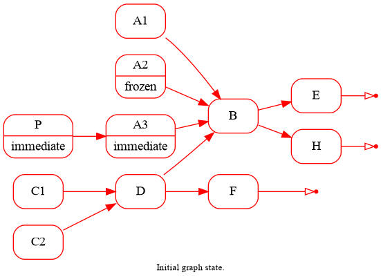
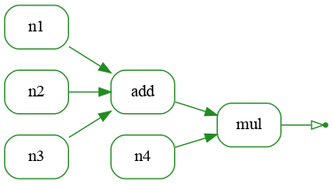

# Summary

DAGFlow is python implementation of dataflow programming with lazy graph evaluation.

Main goals:
*  Lazy evaluated directed acyclic graph
*  Concise connection syntax
*  Plotting with graphviz
*  Flexivility. The goal of DAGFlow is not to be efficient, but rather flexible.

Here is an animation, showing the process of the graph evaluation



# Minimal example
An example of small, graph calculating the formula (n1 + n2 + n3) * n4 may be 
found in the [example](example/example.py):
```python
#!/usr/bin/env python

from __future__ import print_function
from dagflow.node_deco import NodeClass
from dagflow.graph import Graph
from dagflow.graphviz import savegraph
from dagflow.input_extra import MissingInputAddOne
import numpy as N

# Node functions
@NodeClass(output='array')
def Array(node, inputs, output):
    """Creates a note with single data output with predefined array"""
    outputs[0].data = N.arange(5, dtype='d')

@NodeClass(missing_input_handler=MissingInputAddOne(output_fmt='result'))
def Adder(node, inputs, output):
    """Adds all the inputs together"""
    out = None
    for input in inputs:
        if out is None:
            out=outputs[0].data = input.data.copy()
        else:
            out+=input.data

@NodeClass(missing_input_handler=MissingInputAddOne(output_fmt='result'))
def Multiplier(node, inputs, output):
    """Multiplies all the inputs together"""
    out = None
    for input in inputs:
        if out is None:
            out = outputs[0].data = input.data.copy()
        else:
            out*=input.data

# The actual code
with Graph() as graph:
    (in1, in2, in3, in4) = [Array(name) for name in ['n1', 'n2', 'n3', 'n4']]
    s = Adder('add')
    m = Multiplier('mul')

(in1, in2, in3) >> s
(in4, s) >> m

print('Result is:', m.outputs.result.data)
savegraph(graph, 'output/dagflow_example.png')
```

The code produces the following graph:



For `n=[1, 2, 3, 4]` the output is:
```
Result is: [ 0.  3. 12. 27. 48.]
```
